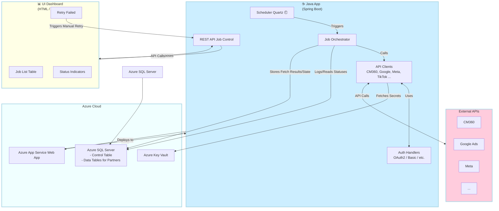

# Design Diagram

```mermaid
%% no config block (GitHub ignores it anyway)
flowchart TD
 subgraph Java_App["☕ Java App\n(Spring Boot)"]
        Java_Scheduler["Scheduler Quartz 🕙"]
        Java_Orchestrator["Job Orchestrator"]
        Java_API_Clients["API Clients\nCM360, Google, Meta, TikTok ..."]
        Java_Auth_Handlers["Auth Handlers\nOAuth2 / Basic / etc."]
        Java_REST_AP_Job_Control["REST API Job Control"]
  end
 
 subgraph Azure_Cloud["Azure Cloud"]
        Azure_App_Service["Azure App Service Web App"]
        Azure_SQL_Server["Azure SQL Server\n- Control Table\n- Data Tables for Partners"]
        Azure_KeyVault["Azure Key Vault"]
  end

 subgraph External_APIs["External APIs"]
        EAPI_CM360["CM360"]
        EAPI_GOOGLE["Google Ads"]
        EAPI_META["Meta"]
        EAPI_MISC["..."]
  end

 subgraph UI["📊 UI Dashboard\n(HTML / React)"]
        C1["Job List Table"]
        C2["Status Indicators"]
        C3["Retry Failed"]
  end

  Azure_App_Service -- Runs --> Java_App
  Java_Scheduler -- Triggers --> Java_Orchestrator
  Java_Orchestrator -- Calls --> Java_API_Clients
  Java_API_Clients <-- Uses --> Java_Auth_Handlers
  Java_Orchestrator -- Logs/Reads Statuses --> Azure_SQL_Server
  Java_REST_AP_Job_Control -- Exposes --> UI
  UI -- API Calls --> Java_REST_AP_Job_Control
  Java_API_Clients -- Fetches Secrets --> Azure_KeyVault
  Java_Orchestrator -- Stores Fetch Results/State --> Azure_SQL_Server
  C3 -- Triggers Manual Retry --> Java_REST_AP_Job_Control
  Java_App -- Deploys to --> Azure_App_Service
  n1["Azure SQL Server"] --> Azure_SQL_Server
  Java_API_Clients <-- API Calls --> External_APIs

%% Styling subgraphs
style Azure_Cloud stroke:lightblue,stroke-width:3px,fill:azure
style Java_App stroke:lightblue,stroke-width:3px,fill:#cceeff
style UI stroke:lightblue,stroke-width:3px,fill:#ffffe6
style External_APIs stroke:lightblue,stroke-width:3px,fill:#ffccdd

%% Optional: make subgraph titles stand out
classDef header fill:lightblue,stroke:lightblue,color:black,font-weight:bold;

```

