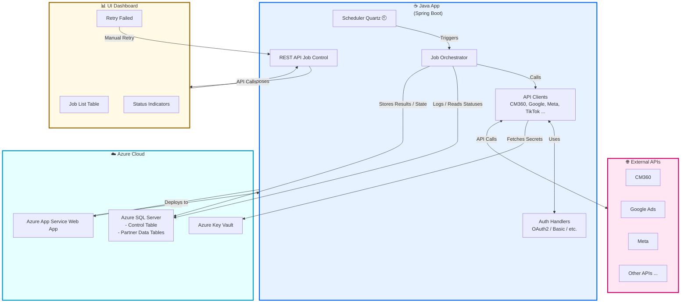

# Design Diagram

```mermaid
flowchart TD
  %% ===== Layers =====
  subgraph Java_App["☕ Java App\n(Spring Boot)"]
    Java_Scheduler["Scheduler Quartz 🕙"]
    Java_Orchestrator["Job Orchestrator"]
    Java_API_Clients["API Clients\nCM360, Google, Meta, TikTok ..."]
    Java_Auth_Handlers["Auth Handlers\nOAuth2 / Basic / etc."]
    Java_REST_AP_Job_Control["REST API Job Control"]
  end

  subgraph Azure_Cloud["☁️ Azure Cloud"]
    Azure_App_Service["Azure App Service Web App"]
    Azure_SQL_Server["Azure SQL Server\n- Control Table\n- Partner Data Tables"]
    Azure_KeyVault["Azure Key Vault"]
  end

  subgraph External_APIs["🌐 External APIs"]
    EAPI_CM360["CM360"]
    EAPI_GOOGLE["Google Ads"]
    EAPI_META["Meta"]
    EAPI_MISC["Other APIs ..."]
  end

  subgraph UI["📊 UI Dashboard\n(HTML / React)"]
    C1["Job List Table"]
    C2["Status Indicators"]
    C3["Retry Failed"]
  end

  %% ===== Edges =====
  Azure_App_Service -- Runs --> Java_App
  Java_Scheduler -- Triggers --> Java_Orchestrator
  Java_Orchestrator -- Calls --> Java_API_Clients
  Java_API_Clients <-- Uses --> Java_Auth_Handlers
  Java_Orchestrator -- Logs / Reads Statuses --> Azure_SQL_Server
  Java_REST_AP_Job_Control -- Exposes --> UI
  UI -- API Calls --> Java_REST_AP_Job_Control
  Java_API_Clients -- Fetches Secrets --> Azure_KeyVault
  Java_Orchestrator -- Stores Results / State --> Azure_SQL_Server
  C3 -- Manual Retry --> Java_REST_AP_Job_Control
  Java_App -- Deploys to --> Azure_App_Service
  Java_API_Clients <-- API Calls --> External_APIs

  %% ===== Subgraph styling (safe on GitHub) =====
  style Java_App stroke:#0066ff,stroke-width:3px,fill:#e6f2ff
  style Azure_Cloud stroke:#0099cc,stroke-width:3px,fill:#e6ffff
  style External_APIs stroke:#cc0066,stroke-width:3px,fill:#ffe6f2
  style UI stroke:#996600,stroke-width:3px,fill:#fff9e6


```

