# Design Diagram

```mermaid
flowchart TD
  %% ===== Layers =====
  subgraph Java_App["☕ Java App\n(Spring Boot)"]
    Java_Scheduler["Scheduler Quartz 🕙"]
    Java_Orchestrator["Job Orchestrator"]
    Java_API_Clients["API Clients\nCM360, Google, Meta, TikTok ..."]
    Java_Auth_Handlers["Auth Handlers\nOAuth2 / Basic / etc."]
    Java_REST_AP_Job_Control["REST API Job Control"]
  end

  subgraph Azure_Cloud["â˜ï¸ Azure Cloud"]
    Azure_App_Service["Azure App Service Web App"]
    Azure_SQL_Server["Azure SQL Server\n- Control Table\n- Partner Data Tables"]
    Azure_KeyVault["Azure Key Vault"]
  end

  subgraph External_APIs["🌠External APIs"]
    EAPI_CM360["CM360"]
    EAPI_GOOGLE["Google Ads"]
    EAPI_META["Meta"]
    EAPI_MISC["Other APIs ..."]
  end

  subgraph UI["📊 UI Dashboard\n(HTML / React)"]
    C1["Job List Table"]
    C2["Status Indicators"]
    C3["Retry Failed"]
  end

  %% ===== Edges =====
  Azure_App_Service -- Runs --> Java_App
  Java_Scheduler -- Triggers --> Java_Orchestrator
  Java_Orchestrator -- Calls --> Java_API_Clients
  Java_API_Clients <-- Uses --> Java_Auth_Handlers
  Java_Orchestrator -- Logs / Reads Statuses --> Azure_SQL_Server
  Java_REST_AP_Job_Control -- Exposes --> UI
  UI -- API Calls --> Java_REST_AP_Job_Control
  Java_API_Clients -- Fetches Secrets --> Azure_KeyVault
  Java_Orchestrator -- Stores Results / State --> Azure_SQL_Server
  C3 -- Manual Retry --> Java_REST_AP_Job_Control
  Java_App -- Deploys to --> Azure_App_Service
  Java_API_Clients <-- API Calls --> External_APIs

  %% ===== Subgraph styling (safe on GitHub) =====
  style Java_App stroke:#0066ff,stroke-width:3px,fill:#e6f2ff
  style Azure_Cloud stroke:#0099cc,stroke-width:3px,fill:#e6ffff
  style External_APIs stroke:#cc0066,stroke-width:3px,fill:#ffe6f2
  style UI stroke:#996600,stroke-width:3px,fill:#fff9e6



```

![Diagram](https://www.mermaidchart.com/play#pako:eNqtVc1u20YQfpWBeogDSFYsIzkwrABFVhylEpxYcnuoC2FJjihCa66wu4wtF3mBXIMA6Snv1ifII3RmKdKkRQcuEEIAubPzffM_-rsVqghbXqvT6VymoUqXSexdpgB2hVfowVXIBym2KrMeoFy7o1JrD0IpjEno3kGXUl2HK6EtzE9Ix2RBrMVmBW_FB7EYbDZ_XrZ8sxF0Y7cSf30SKqm0p-Pg4Fkbjp712tB7_vzpS1iq1HauMYlXZC9QMtqJTHJL7hwd9vDq5ZM-_Pv1i6MGovYD3T-YbXSSxvBKKfvU77Kl_mXrL_Y2f5wfs3CFUSZRkzflN7zPyO1b-P7tyz_7kDNNesZqYRWj3qoAqiLYRwzejRdDmWBqDQHoBLsT-zmcHr-ggE-ViiW2YYpWtGGerOdqDYeHhw1smV0t3og0Ik8dH52hODPjGUt63VeCatFFGzZwnI9mc3JrQc4vhpRMrSQxsRTYPY5pJ95hMY3oVS3j4DbTSGGpLPq5lXTE4IibypbbpSIvZqg_JCFyChyEZLCTwR8Y8LkBOXs_cUhXcj_YmSMp5FK_G_Q5i34m-75M-p0iEzAXgUS_S7JcfiKsyIWG4tDwjpom5Ro4lS7hG8z_htvfRSZt6TUJwEmqmeaPMtOjG4s6FZL7yPww1_x7dJ4LWq64acr0yPUttycZde_969Ozs9PJiO7z_oVBZPaVpqP5gFS4tRsux7MhXd61epGAMv6L8c9tsO_fPn8iUqqfWQVK6AgO3synk-45irB5VQyPdoM-SYzNS16_7_H6sMJmBsZplIS8COqJGB7zgKHVW3gtEonR_XLv9TV0OnCepYbe_XJpsmZ9cbHaXCdxTJ13p1rdSCWmtqYINhRSVunv1lQJqcjAJ8iFwSqiuooeNDNRseHkRgbyHO0o7s9jSdCwnZhndLNRBfZizNpURJK7hVoPpYGhMSRCv6YNSe7S9IcabdWzYlQfDGxGb0I6BjhHQ7qmyyHig_ENj2v1moo0ownM--Jx3tOSI4YT3Ei1NWBVxVSleVg_PSqXzN16o7b7cfLvV7ye3dou4sZ1E1n9M6AZ1WqNnuQpDGSG7VzQuU4iu_KONzftZSKlJxhS4MvQHgn-JQwRl8sCTn3wWOCSHnxRAGvh_A-OMIyi1sf_ACsLB3g)

